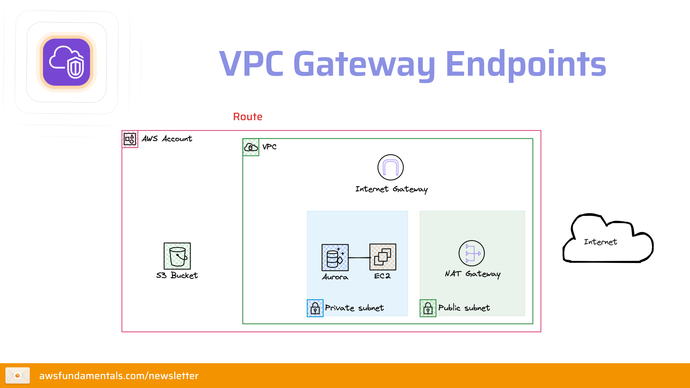

# Gateway Endpoints for S3

🔑 Securely Connecting to Managed Services like S3 from within VPCs



## How it works

This project uses AWS Gateway Endpoints to securely connect to S3 from within a VPC.

## How to deploy

You can deploy the app to your AWS account by running the following command:

```bash
pnpmi i
npx sst deploy --stage dev
```

> **Important Note**: This project must be deployed to AWS using `npx sst deploy` and cannot be tested with `npx sst dev` in local development mode. The Lambda function can't be invoked in the local development environment.
